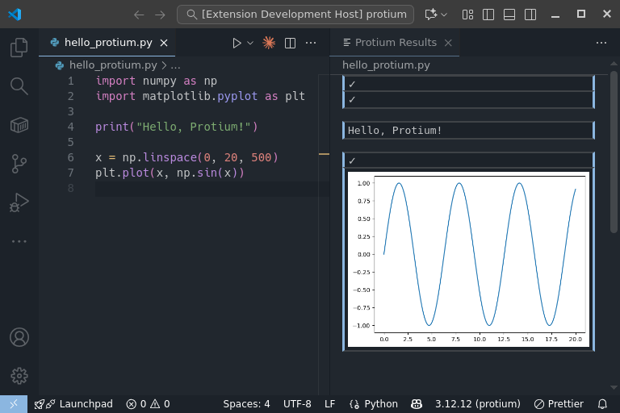

# Protium

Interactive Python environment for VS Code with flexible execution in your workflow.

## Features

- **Flexible execution**: Run exactly what you need — a single line, a code block, or a selection
- **Results that follow you**: View plots, images, and DataFrames that update as you switch files
- **Session control**: Connect files to different kernels or share a kernel across multiple files
- **Kernel monitor**: Track execution status, counts, and connected files in real-time
- **Watch list**: Automatically evaluate expressions after each execution

## Getting Started

1. Install the extension from VS Code Marketplace
2. Open a Python file (`.py`)
3. Place cursor on code you want to execute
4. Press `Shift+Enter` to execute
5. View results in the "Protium Results" panel

_Note: If `ipykernel` is not installed, Protium will prompt you to install it automatically._

## Commands

| Command                    | Description                          | Keybinding       |
| -------------------------- | ------------------------------------ | ---------------- |
| Execute and Move Next      | Execute code block and move to next  | `Shift+Enter`    |
| Execute in Place           | Execute code block without moving    | `Ctrl+Enter`     |
| Interrupt Execution        | Stop currently running code          | `Ctrl+Shift+C`   |
| Clear Results              | Clear results for current file       | `Ctrl+Backspace` |
| Connect to Existing Kernel | Connect current file to a kernel     | —                |
| Restart Kernel             | Restart the kernel for current file  | —                |
| Shutdown Kernel            | Shutdown the kernel for current file | —                |
| Show Kernel Monitor        | Open the Kernel Monitor panel        | —                |
| Show Watch List            | Open the Watch List sidebar          | —                |

## Settings

- `protium.resultDisplay.maxLines`: Maximum number of lines to display in result blocks (default: 20)

## Documentation

- [Design Document](docs/design.md): System architecture and design philosophy
- [Features Specification](docs/features.md): Detailed feature requirements
- [Development Guide](docs/development.md): Setup and coding conventions
- [Change Log](CHANGELOG.md): Release history and version notes

## License

See [LICENSE](LICENSE) file for details.
