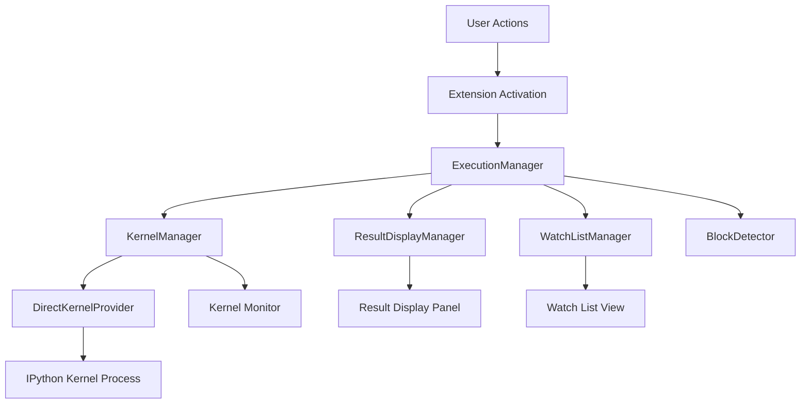
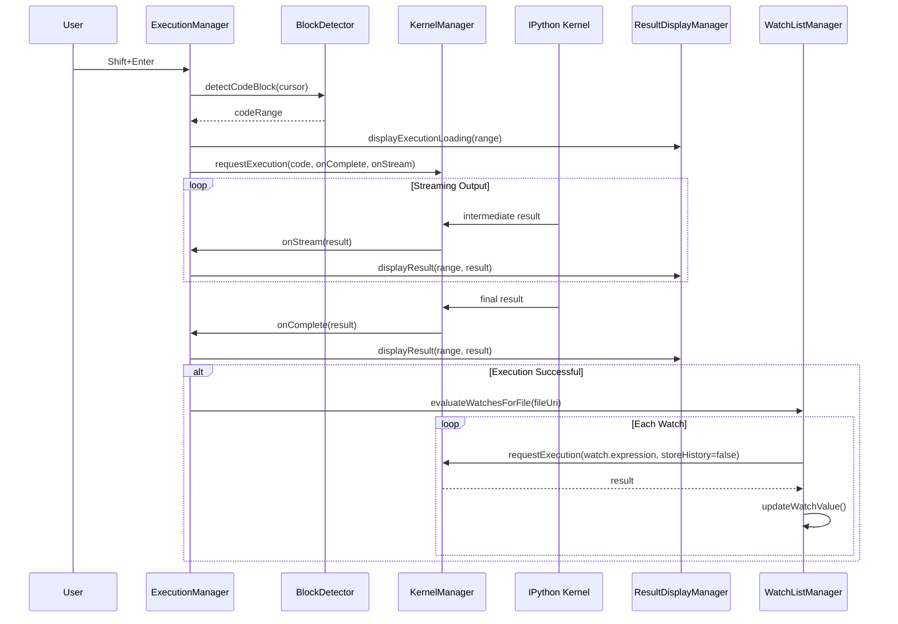
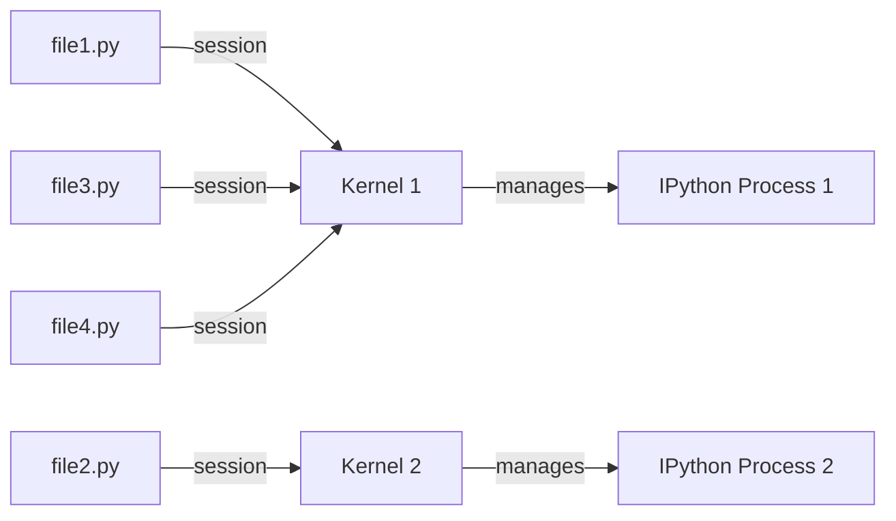
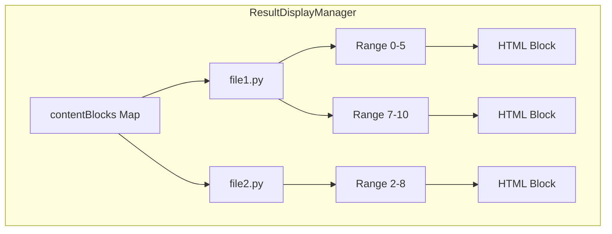
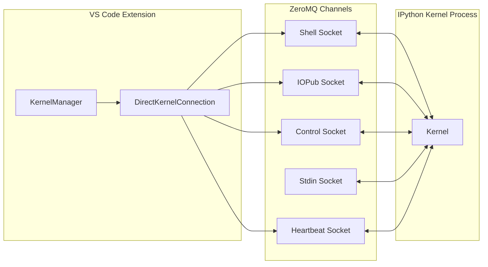

# Design Document

## System Architecture

### Overview

Protium is a VS Code extension that enables interactive Python code execution within the editor. It launches Jupyter kernels directly and provides a REPL-like execution experience within regular .py files.

### Core Architecture



### Component Responsibilities

#### ExecutionManager

**Role**: Orchestrator

- Manages file-to-kernel session mappings (`sessions: Map<fileUri, kernelId>`)
- Controls code execution flow
- Coordinates between all managers
- Triggers automatic watch expression evaluation

**Key Design Decisions**:

- Creates one kernel per file automatically on first execution
- Allows users to explicitly share kernels across multiple files
- Removes all associated file sessions when kernel is shut down

#### KernelManager

**Role**: Kernel lifecycle management

- Caches kernel instances (`kernels: Map<kernelId, IKernelConnection>`)
- Handles non-blocking execution requests
- Supports streaming output
- Monitors and notifies kernel status changes

**Key Design Decisions**:

- `requestExecution()` is callback-based and non-blocking
- `onStream` callback provides real-time intermediate results
- `onComplete` callback handles final results
- Kernels process execution requests serially (no concurrent execution)

#### DirectKernelProvider

**Role**: Kernel process startup and connection management

- Launches IPython kernels directly without Jupyter server
- Uses ZeroMQ for low-level communication
- Generates and manages connection files
- Supports automatic ipykernel installation

**Key Design Decisions**:

- Stores connection files in temp directory (`/tmp/protium-kernels/`)
- Dynamically allocates 5 consecutive ports (shell, iopub, control, stdin, hb)
- Preserves kernel ID during restart
- Automatic cleanup on process termination

#### BlockDetector

**Role**: Python code block detection

- Determines code blocks based on cursor position
- Decides block boundaries using indentation levels
- Groups control flow constructs (if/elif/else, try/except/finally, etc.)

**Key Design Decisions**:

- Selection takes precedence over automatic detection
- Decorators are grouped with function/class definitions
- Empty lines and comments are skipped but included within blocks

#### ResultDisplayManager

**Role**: Execution result display and persistence

- Stores results as HTML blocks (`contentBlocks: Map<fileUri, Map<Range, HTML>>`)
- Restores results when switching files
- Renders rich MIME data (images, plots, HTML)

**Key Design Decisions**:

- Results indexed by file URI and code range
- Results persist across panel close/reopen
- During streaming updates, overwrites result for same range
- Only updates display for active file (non-active file results are stored only)

#### WatchListManager

**Role**: Watch expression management and evaluation

- Similar functionality to debugger watch expressions
- Manages watch expressions per file
- Stores evaluation results and MIME data

**Key Design Decisions**:

- Watch expressions are associated with files
- Auto-evaluates watches for file after successful code execution
- Uses `storeHistory=false` during evaluation to avoid incrementing execution count
- No streaming for watch evaluation due to kernel's serial processing

### Execution Flow



### Session Management



- Default: Each file gets a new kernel on first execution
- "Connect to Existing Kernel" allows sharing kernels across multiple files
- When kernel shuts down, all associated sessions are removed

### Result Storage Strategy



- Results stored in two-level Map by file URI and code range
- Overwrites result when re-executing same range
- Restores stored results when switching files
- Results persist even when panel is hidden

### Kernel Communication



- Communicates directly with kernel via ZeroMQ (no Jupyter server required)
- Connection information stored in JSON format in temporary files
- Connection file automatically deleted when kernel process terminates

### WebView Architecture

```mermaid
graph TB
    subgraph Extension Host
        EM[ExecutionManager]
        KernelMonitor[Kernel Monitor Provider]
        WatchListView[Watch List Provider]
    end

    subgraph WebView (Kernel Monitor)
        KMWebView[Kernel Monitor HTML]
        KMScript[JavaScript Handler]
    end

    subgraph WebView (Watch List)
        WLWebView[Watch List HTML]
        WLScript[JavaScript Handler]
    end

    EM --> KernelMonitor
    EM --> WatchListView
    KernelMonitor <--> KMWebView
    WatchListView <--> WLWebView
    KMWebView --> KMScript
    WLWebView --> WLScript
```

- Bidirectional messaging for WebView communication
- Kernel Monitor: Displays kernel status, execution count, connected files
- Watch List: Displays watch expressions and evaluation results with edit functionality

### Error Handling Philosophy

1. **User-Friendly**: Error messages are clear and actionable
2. **Auto-Recovery**: Suggests automatic installation when ipykernel is missing
3. **Resource Cleanup**: Always releases resources even on error
4. **Logging**: Logs all errors to Output Channel

### Performance Considerations

- **Non-Blocking Execution**: Does not block UI thread
- **Streaming Output**: Displays intermediate results during long-running execution
- **Result Caching**: Avoids recomputation when switching files
- **Serial Execution**: Kernel processes one request at a time

### Extension Points

Designed for future extensibility:

- **IKernelProvider**: Allows implementing different kernel launch methods
- **Result Renderers**: Custom rendering per MIME type
- **Block Detection**: Potential support for different languages
- **Session Management**: Can support more complex session strategies
